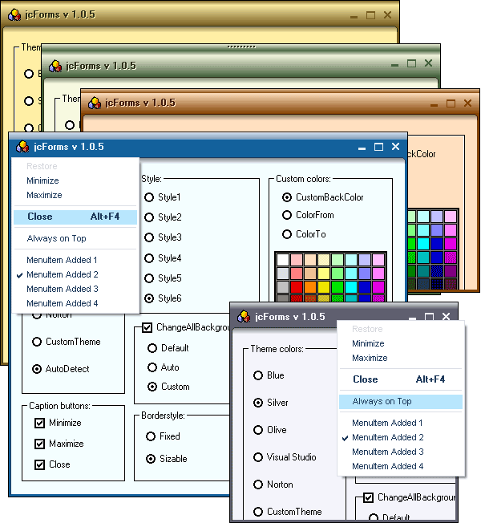



## jcForms v1\.0\.5 \(new updating\)

### Description

It's a nice usercontrol that enables you to skin the form. It includes 6 attractive styles, 5 theme colors and 3 backcolor styles. In this version I have added new features and fixed some errors. Have a look at screenshot. Enjoy it!.
 
### More Info
 

             |
---                |---
**Submitted On**   |2006-04-18 00:03:06
**By**             |[Juan Carlos San Román](https://github.com/Planet-Source-Code/PSCIndex/blob/master/ByAuthor/juan-carlos-san-rom-n.md)
**Level**          |Intermediate
**User Rating**    |4.9 (292 globes from 60 users)
**Compatibility**  |VB 6\.0
**Category**       |[Custom Controls/ Forms/  Menus](https://github.com/Planet-Source-Code/PSCIndex/blob/master/ByCategory/custom-controls-forms-menus__1-4.md)
**World**          |[Visual Basic](https://github.com/Planet-Source-Code/PSCIndex/blob/master/ByWorld/visual-basic.md)
**Archive File**   |[jcForms\_v11988034182006\.zip](https://github.com/Planet-Source-Code/juan-carlos-san-rom-n-jcforms-v1-0-5-new-updating__1-64657/archive/master.zip)

